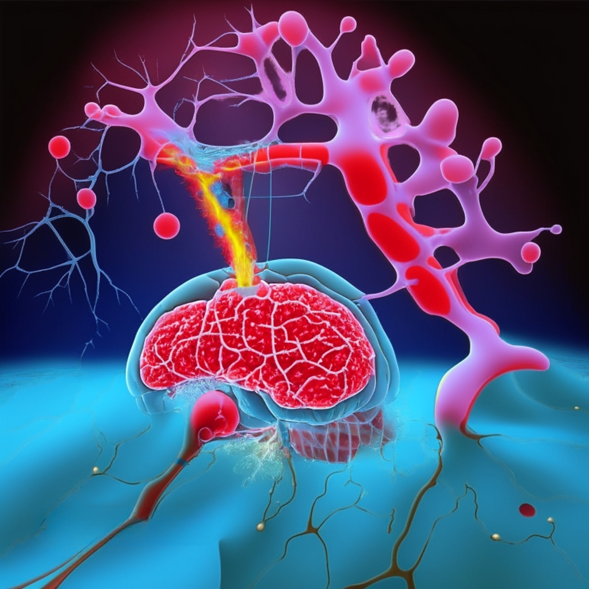

# Molecular Representation Learning with Quotient Graphs

This repository contains the code and report for the study on molecular representation learning using quotient graphs. The goal of this project was to explore the effectiveness of quotient graphs in graph classification and graph regression tasks, focusing on two datasets: BBBP (Blood–brain barrier penetration) and Lipophilicity.

## Contents

- classification_code.ipynb: Jupyter Notebook containing the code for the classification task using the BBBP dataset.
- regression_code.ipynb: Jupyter Notebook containing the code for the regression task using the Lipophilicity dataset.
- data/: https://github.com/hhaji/funqg
- report.pdf: The detailed report documenting the study methodology, experiments, and results.

## Requirements

- Python 3.x
- Jupyter Notebook
- PyTorch
- DGL (Deep Graph Library)
- Scikit-learn

## Reference
If you use this code or find it helpful in your research, please consider citing the following repository:
FunQG: A Quotient Graph Approach for Graph Classification in PyTorch. Zahra Taheri. GitHub repository. https://github.com/hhaji/funqg

## Author

This project was developed by Mohammad Rezaei Kalantary, with the guidance and support of Professor Zahra Taheri. You can find the author's GitHub profile at [https://github.com/Mohmmad-RezaeiKalantary](https://github.com/Mohmmad-RezaeiKalantary), and Professor Zahra Taheri's GitHub profile at [https://github.com/zahta](https://github.com/zahta).

